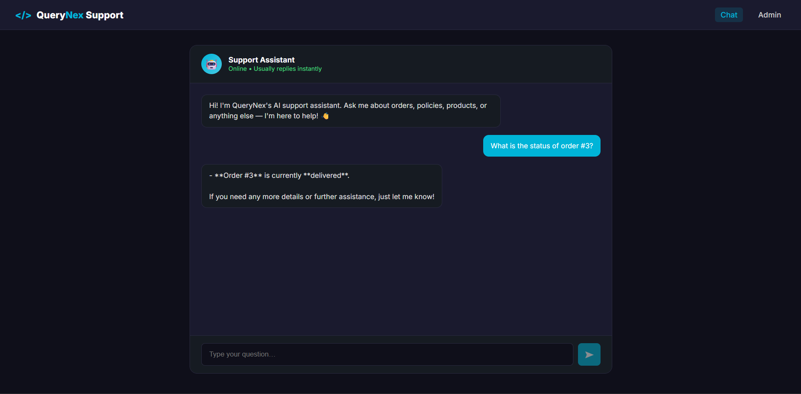
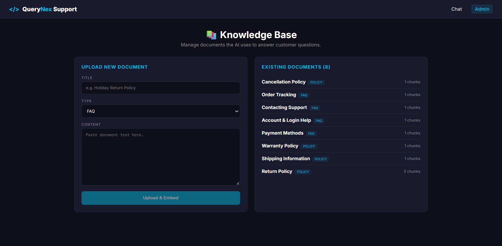

# AI Customer Support Agent (RAG)

> A RAG-powered customer support assistant that answers policy questions from your knowledge base and looks up real customer data — with source citations and smart escalation.

[](https://dotnet.microsoft.com)
[](https://angular.io)
[](https://www.postgresql.org)
[](https://github.com/pgvector/pgvector)
[](https://groq.com)
[](LICENSE)

A production-style customer support chatbot that combines **Retrieval-Augmented Generation (RAG)** with **live database lookups**. Users ask questions in plain English; the agent retrieves relevant policy documents, queries live order data when needed, cites its sources, and escalates to a human when confidence is low.

---

## 📸 Screenshots

> Add your own screenshots after recording a demo. Suggested folder: `docs/screenshots/`

| Chat Interface | Admin — Knowledge Base |
|---------------|------------------------|
|  |  |

---

## ✨ Features

- 💬 **Natural Language Chat** — Ask questions about policies, orders, products, or anything else
- 📚 **RAG over Knowledge Base** — Semantic search using pgvector and cosine similarity
- 📎 **Source Citations** — Every answer that uses documents links back to its source with a match score
- 🔍 **Live Data Lookups** — Automatically queries the same PostgreSQL database for orders, products, and customers
- ⚠️ **Smart Escalation** — If no confident answer can be found, offers to create a support ticket
- 📥 **Admin Panel** — Upload new documents through a UI; chunking + embedding happens automatically
- 🎨 **Modern Angular 22 UI** — Signals, standalone components, `@if`/`@for`, OnPush change detection
- 🔐 **Secret Management** — All API keys and DB credentials in .NET User Secrets
- 🧠 **pgvector-Powered** — Fast, low-cost semantic search without a separate vector database

---

## 🏗️ Architecture

```
┌────────────────────────────────────────────────────────────┐
│                    Angular 22 Chat UI                       │
│  ┌─────────────────────────┐  ┌─────────────────────────┐  │
│  │  Chat Panel             │  │  Admin Panel            │  │
│  │  (customer view)        │  │  (knowledge base mgmt)  │  │
│  └─────────────────────────┘  └─────────────────────────┘  │
└──────────────────────────┬─────────────────────────────────┘
                           │ HTTP
                           ▼
┌────────────────────────────────────────────────────────────┐
│                  .NET 10 Web API                           │
│                                                            │
│  ┌──────────────────────────────────────────────────────┐ │
│  │  ChatOrchestratorService                             │ │
│  │  ┌──────────────────┐  ┌───────────────────────────┐ │ │
│  │  │ DocumentRetriever│  │ CustomerDataService       │ │ │
│  │  │ (pgvector search)│  │ (SQL lookups on orders)   │ │ │
│  │  └──────────────────┘  └───────────────────────────┘ │ │
│  └──────────────────────────────────────────────────────┘ │
│                                                            │
│  ┌────────────────────┐  ┌──────────────────────────────┐ │
│  │ DocumentIngestion  │  │ EmbeddingService             │ │
│  │ (chunk + store)    │  │ (HuggingFace / Ollama)       │ │
│  └────────────────────┘  └──────────────────────────────┘ │
└──────────────────────────┬─────────────────────────────────┘
                           │
                           ▼
┌────────────────────────────────────────────────────────────┐
│        PostgreSQL (Neon) + pgvector extension              │
│  Existing: customers, orders, products, categories…        │
│  New:      documents, document_chunks (with embeddings),   │
│            chat_sessions, chat_messages, support_tickets   │
└────────────────────────────────────────────────────────────┘
```

**Request Flow:**

1. User sends a message in the Angular chat UI
2. Backend embeds the query and retrieves top-K relevant chunks via pgvector cosine similarity
3. If the message mentions an order number, backend queries the `orders` table for live data
4. Groq combines retrieved context + live data to generate a natural answer with citations
5. If both retrieval and data lookup return nothing useful, the response is flagged as **escalated**
6. Admin panel lets you upload new documents — chunking, embedding, and storage happen automatically

---

## 🛠️ Tech Stack

| Layer | Technology | Version |
|-------|-----------|---------|
| **Frontend** | Angular (Standalone + Signals) | 22 |
| **Backend** | .NET Core Web API | 10 |
| **Database** | PostgreSQL + pgvector | 16+ |
| **AI Provider** | Groq (OpenAI-compatible API) | `openai/gpt-oss-120b` |
| **Embeddings** | Hugging Face Inference API **or** Ollama | MiniLM-L6-v2 (384d) / nomic-embed-text (768d) |
| **DB Driver** | Npgsql + Pgvector.Npgsql | Latest |

---

## 📁 Project Structure

```
ai-support-agent/
├── WebAPI/
│   └── SupportAgent.API/
│       ├── Controllers/
│       │   ├── ChatController.cs
│       │   └── DocumentsController.cs
│       ├── Models/
│       │   └── Dtos.cs
│       ├── Services/
│       │   ├── ChatOrchestratorService.cs
│       │   ├── CustomerDataService.cs
│       │   ├── DocumentIngestionService.cs
│       │   ├── DocumentRetrieverService.cs
│       │   └── EmbeddingService.cs
│       ├── Program.cs
│       └── appsettings.json
├── support-agent-ui/
│   └── src/
│       └── app/
│           ├── chat/
│           │   ├── chat.ts
│           │   ├── chat.html
│           │   └── chat.css
│           ├── admin/
│           │   ├── admin.ts
│           │   ├── admin.html
│           │   └── admin.css
│           ├── support.service.ts
│           ├── app.ts
│           ├── app.config.ts
│           └── app.routes.ts
├── database/
│   ├── 04_rag_support.sql
│   └── 05_sample_documents.sql
├── docs/
│   └── screenshots/
├── .gitignore
├── LICENSE
└── README.md
```

---

## 🚀 Getting Started

### Prerequisites

- [.NET 10 SDK](https://dotnet.microsoft.com/download/dotnet/10.0)
- [Node.js 22.12+](https://nodejs.org)
- [Angular CLI 22+](https://angular.io/cli) (`npm install -g @angular/cli@latest`)
- [PostgreSQL 16+](https://www.postgresql.org/download/) — or a free [Neon](https://neon.tech) account with `pgvector` support
- [Groq API Key](https://console.groq.com) — free
- **Embedding provider** — either:
  - [Hugging Face token](https://huggingface.co/settings/tokens) (free, needs Inference Providers permission), or
  - [Ollama](https://ollama.com/download) (free, runs locally)

---

### 1️⃣ Database Setup

This project **reuses the e-commerce database** from the AI SQL Query Generator project.

**Load the RAG additions:**

```bash
psql "postgresql://...neon.tech/neondb?sslmode=require" -f database/04_rag_support.sql
```

This creates:
- `documents` and `document_chunks` (with `vector(384)` embeddings + IVFFlat index — **note: drop the index if you have fewer than 1,000 chunks**)
- `chat_sessions` and `chat_messages`
- `support_tickets`
- Enables the `vector` extension

> ⚠️ **Important:** The IVFFlat index can silently return zero results on small datasets. If your chunks count is under ~1,000, drop it:
> ```sql
> DROP INDEX IF EXISTS idx_chunks_embedding;
> ```

**Documents are loaded via the admin panel, not via SQL.** The SQL script `05_sample_documents.sql` is a reference only — its rows have no embeddings. Use `/admin` in the UI to upload.

---

### 2️⃣ Backend Setup

```powershell
cd WebAPI/SupportAgent.API
dotnet restore
dotnet user-secrets init
```

**Configure secrets:**

```powershell
# Groq AI (required)
dotnet user-secrets set "Groq:ApiKey" "gsk_your_key"
dotnet user-secrets set "Groq:Model" "openai/gpt-oss-120b"

# PostgreSQL (Neon)
dotnet user-secrets set "ConnectionStrings:DefaultConnection" `
  "Host=ep-xxx.neon.tech;Port=5432;Database=neondb;Username=neondb_owner;Password=...;SSL Mode=Require;Trust Server Certificate=true"

# Hugging Face (if using HF embeddings)
dotnet user-secrets set "HuggingFace:ApiKey" "hf_your_token"
```

**Embedding provider options:**

| Provider | Package | Dimensions | Notes |
|----------|---------|-----------|-------|
| **Hugging Face** | `all-MiniLM-L6-v2` | 384 | Cloud, requires token with **Inference Providers** permission |
| **Ollama** | `nomic-embed-text` | 768 | Local install, no token, no rate limits |

If you use Ollama, remember to change the vector column to `vector(768)`:

```sql
DELETE FROM document_chunks;
ALTER TABLE document_chunks ALTER COLUMN embedding TYPE vector(768);
```

**Run the API:**

```powershell
dotnet run --launch-profile https
```

API runs at `https://localhost:7111` (check `launchSettings.json` for your actual port).
Swagger UI: `https://localhost:7111/swagger`

---

### 3️⃣ Frontend Setup

```powershell
cd support-agent-ui
npm install
```

**Update the API URL** in `src/environments/environment.development.ts`:

```typescript
export const environment = {
  production: false,
  apiBase: 'https://localhost:7111/api'
};
```

**Run the dev server:**

```powershell
ng serve --open
```

Frontend runs at `http://localhost:4200`.

---

### 4️⃣ Populate the Knowledge Base

This is the crucial step. Documents must be uploaded **through the admin panel** so they get chunked + embedded.

1. Open `http://localhost:4200/admin`
2. For each document from `database/05_sample_documents.sql`, fill in:
   - **Title**
   - **Type** (`faq`, `policy`, `manual`, `product`)
   - **Content** (full text)
3. Click **Upload & Embed** — wait 2–3 seconds per document

Verify in Neon:

```sql
SELECT
  d.title,
  COUNT(c.chunk_id) AS chunks,
  COUNT(c.embedding) AS with_embedding
FROM documents d
LEFT JOIN document_chunks c ON c.document_id = d.document_id
GROUP BY d.title
ORDER BY d.title;
```

Every document should have `chunks > 0` and `with_embedding = chunks`.

---

## 🔌 API Reference

### `POST /api/chat`

Send a message; get an AI answer with source citations.

**Request:**
```json
{
  "message": "What is your return policy?",
  "sessionId": null,
  "customerId": null
}
```

**Response:**
```json
{
  "answer": "Our return policy allows customers to return any product within 30 days of purchase for a full refund [1]. The product must be in original packaging...",
  "sessionId": "3f7a8b9c-...",
  "sources": [
    {
      "documentId": 1,
      "title": "Return Policy",
      "snippet": "Our return policy allows customers to return any product within 30 days...",
      "similarity": 0.82
    }
  ],
  "escalated": false,
  "error": null
}
```

---

### `GET /api/documents`

List all documents in the knowledge base.

**Response:**
```json
[
  {
    "documentId": 1,
    "title": "Return Policy",
    "sourceType": "policy",
    "chunkCount": 3,
    "uploadedAt": "2026-01-15T10:23:00Z"
  }
]
```

---

### `POST /api/documents`

Upload a new document. Chunking + embedding happen automatically.

**Request:**
```json
{
  "title": "Holiday Return Policy",
  "sourceType": "policy",
  "content": "During the holiday season (November 15 – December 31)...",
  "sourceUrl": null
}
```

**Response:**
```json
{
  "documentId": 9,
  "chunkCount": 2,
  "success": true,
  "error": null
}
```

---

## 🧠 How RAG Works in This Project

1. **Ingestion** — When you upload a document:
   - Text is split into chunks (~500 chars, 80-char overlap) at paragraph and sentence boundaries
   - Each chunk (prepended with the document title for richer context) is embedded into a 384- or 768-dim vector
   - Chunks + vectors are stored in PostgreSQL via pgvector

2. **Retrieval** — When a user asks a question:
   - The question is embedded using the same model
   - pgvector computes cosine similarity against all chunks
   - Top-K chunks (default 8) are returned with their titles and similarity scores

3. **Generation** — The retrieved chunks + any live data lookups are passed to Groq:
   - The LLM generates a natural, concise answer
   - It cites sources inline as `[1]`, `[2]`, etc.
   - Sources are also returned separately for the UI to display

4. **Escalation** — If no chunk exceeds the similarity threshold and no live data was found, `escalated = true` and the UI offers to create a ticket.

---

## 🗄️ Database Schema

### New Tables

| Table | Purpose |
|-------|---------|
| `documents` | Uploaded knowledge base documents (title, type, raw content) |
| `document_chunks` | Chunked text + `vector(384 or 768)` embeddings |
| `chat_sessions` | Chat session metadata (customer, timestamps, escalation flag) |
| `chat_messages` | Individual messages (user / assistant) with JSONB sources |
| `support_tickets` | Escalated tickets |

### Reused Tables

| Table | Used For |
|-------|----------|
| `customers` | Customer identification |
| `orders` | Order status lookups ("Where is order #42?") |
| `products` | Product info lookups |
| `categories` | Product categorization |

---

## 🔒 Security

| Protection | Implementation |
|------------|---------------|
| **Secrets** | .NET User Secrets (never committed) |
| **CORS** | Restricted to `http://localhost:4200` |
| **Parameterized queries** | Npgsql parameters everywhere — no SQL injection surface |
| **pgvector type safety** | `Pgvector.Vector` wrapper with registered `NpgsqlDataSource` |
| **SSL to database** | Neon requires `SSL Mode=Require` |

---

## 🧪 Sample Questions to Try

| Question | What It Demonstrates |
|----------|---------------------|
| `What is your return policy?` | Pure RAG retrieval |
| `How long does shipping take?` | Multi-chunk retrieval quality |
| `What is the status of order #3?` | Live data lookup |
| `Do you offer warranty on electronics?` | Policy retrieval |
| `How do I reset my password?` | FAQ retrieval |
| `Can I cancel my order?` | Cancellation policy match |
| `What's the weather like?` | Should trigger escalation |

---

## 🧗 Challenges Solved

- **Hugging Face endpoint migration** — Old `api-inference.huggingface.co` was retired; migrated to `router.huggingface.co/hf-inference/...` and required a token with **Inference Providers** permission
- **pgvector type mismatch** — `operator does not exist: vector <=> real[]` — fixed by wrapping query vectors in `Pgvector.Vector` and using a registered `NpgsqlDataSource` instead of raw connection strings
- **Column order bug** — `reader.GetDateTime(4)` on a `bigint` — fixed by reordering `SELECT` to match the reader, and switched to `GetOrdinal()` for future safety
- **IVFFlat index on tiny dataset** — silently returned zero results; dropped the index until chunks reach ~1,000+
- **RAG recall quality** — Added title-prepending to chunks before embedding, increased top-K from 4 to 8, and added a 0.35 similarity threshold
- **Angular 22 naming** — New class convention `App` (not `AppComponent`) required updating `main.ts` imports

---

## ☁️ Deployment

| Component | Recommended Service | Free Tier |
|-----------|--------------------|-----------|
| **Frontend** | Azure Static Web Apps | 500 MB, 100 GB bandwidth/month |
| **Backend** | Azure App Service (F1) | 1 GB disk, 60 min CPU/day |
| **Database** | Neon | 0.5 GB, pgvector support, auto-suspend |
| **AI (LLM)** | Groq | Generous free tier |
| **AI (Embeddings)** | Hugging Face (free tier) or Ollama (self-host) | Free |

**Before deploying:**

1. Update `environment.ts` with the production API URL
2. Add production CORS origin in `Program.cs`
3. Set secrets as **App Service environment variables** (not user-secrets)
4. Set the HuggingFace / Groq keys in App Service → Configuration → Application settings

---

## 🤝 Contributing

Contributions, issues, and feature requests are welcome!

1. Fork the repository
2. Create a feature branch (`git checkout -b feature/amazing-feature`)
3. Commit your changes (`git commit -m 'Add amazing feature'`)
4. Push the branch (`git push origin feature/amazing-feature`)
5. Open a Pull Request

---

## 📄 License

This project is licensed under the MIT License — see the [LICENSE](LICENSE) file for details.

---

## 👤 Author

**QueryNex**
- Portfolio: [querynexai.github.io](https://querynexai.github.io)
- GitHub: [@querynexai](https://github.com/querynexai)
- Email: querynex.ai@outlook.com

---

## ⭐ Show Your Support

If this project helped you, please give it a star ⭐ — it helps others discover it too.

---

## 🙏 Acknowledgements

- [pgvector](https://github.com/pgvector/pgvector) for bringing vector search to PostgreSQL
- [Pgvector-dotnet](https://github.com/pgvector/pgvector-dotnet) for the .NET bindings
- [Groq](https://groq.com) for fast, free LLM inference
- [Neon](https://neon.tech) for serverless PostgreSQL
- [Hugging Face](https://huggingface.co) for open embedding models
- [Ollama](https://ollama.com) for local, no-API embeddings
- The open-source .NET, Angular, and PostgreSQL communities